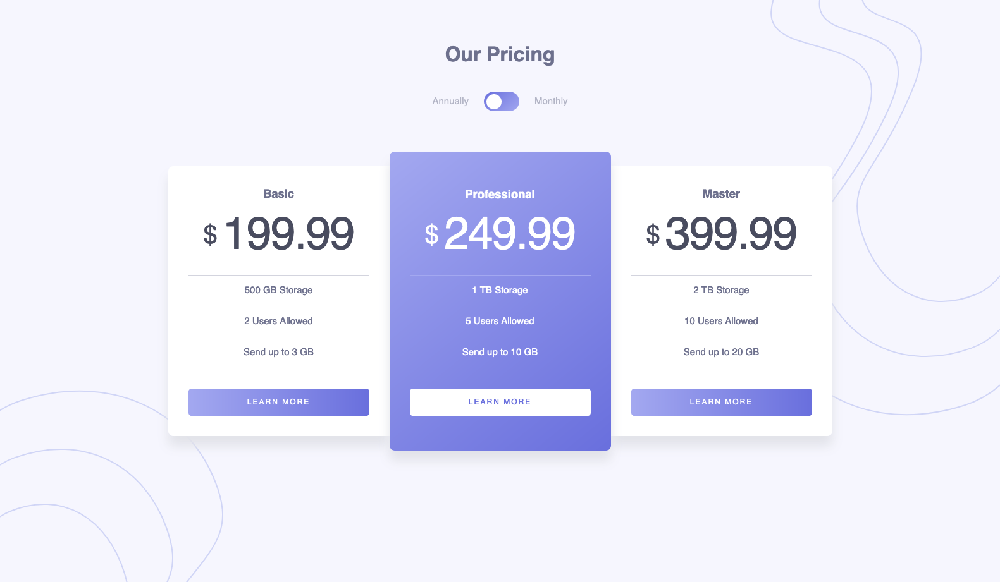

# Frontend Mentor - Pricing component with toggle solution

This is a solution to the [Pricing component with toggle challenge on Frontend Mentor](https://www.frontendmentor.io/challenges/pricing-component-with-toggle-8vPwRMIC). Frontend Mentor challenges help you improve your coding skills by building realistic projects. 

## Table of contents

- [Overview](#overview)
  - [The challenge](#the-challenge)
  - [Screenshot](#screenshot)
  - [Links](#links)
- [My process](#my-process)
  - [Built with](#built-with)
  - [What I learned](#what-i-learned)
  - [Continued development](#continued-development)
- [Author](#author)
- [Acknowledgments](#acknowledgments)

## Overview

### The challenge

Users should be able to:

- View the optimal layout for the component depending on their device's screen size
- Control the toggle with both their mouse/trackpad and their keyboard
- **Bonus**: Complete the challenge with just HTML and CSS

### Screenshot

Add a screenshot of your solution. The easiest way to do this is to use Firefox to view your project, right-click the page and select "Take a Screenshot". You can choose either a full-height screenshot or a cropped one based on how long the page is. If it's very long, it might be best to crop it.

Alternatively, you can use a tool like [FireShot](https://getfireshot.com/) to take the screenshot. FireShot has a free option, so you don't need to purchase it. 

Then crop/optimize/edit your image however you like, add it to your project, and update the file path in the image above.

### Links

- Solution URL: [FrontendMentor.io]()
- Live Site URL: [https://ericsalvi.github.io/pricing-component-with-toggle/](https://ericsalvi.github.io/pricing-component-with-toggle/)

## My process

### Built with

- Semantic HTML5 markup
- Flexbox
- CSS Grid
- Mobile-first workflow

### What I learned

This particular project was a collaboration with [@maiaflow](https://github.com/maiaflow). We continued to learn how to do these projects together. One of the biggest things we accomplished on this project was to create the toggle interactivity using only HTML and CSS. We decided to use JS only to set the pricing changes. 

### Continued development

I am looking forward to more collaborations with [@maiaflow](https://github.com/maiaflow).

## Author

- Website - [Eric Salvi](https://github.com/ericsalvi)
- Frontend Mentor - [@ericsalvi](https://www.frontendmentor.io/profile/ericsalvi)
- Website - [Maiaflow](https://github.com/maiaflow)
- Frontend Mentor - [@maiaflow](https://www.frontendmentor.io/profile/maiaflow)

## Acknowledgments

Thank you again Maia for wanting to do these challenges in a collaboration setting. We haven't mastered how to do the work simultaneously but it is always lots of fun screen sharing through Zoom. 
